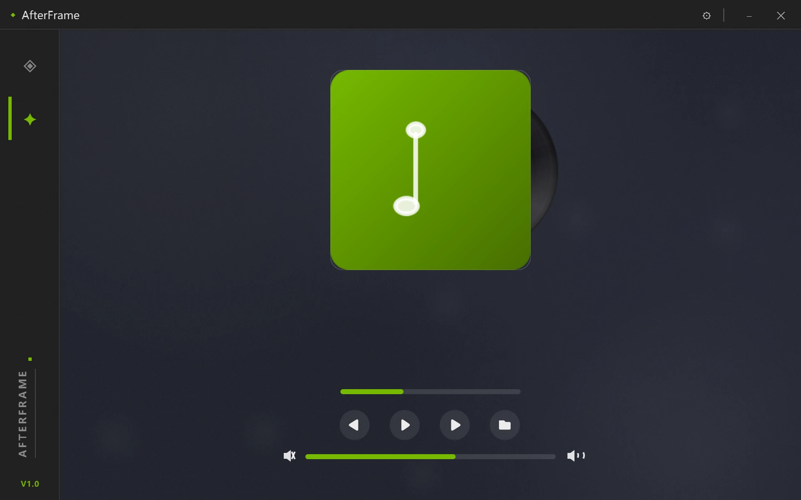
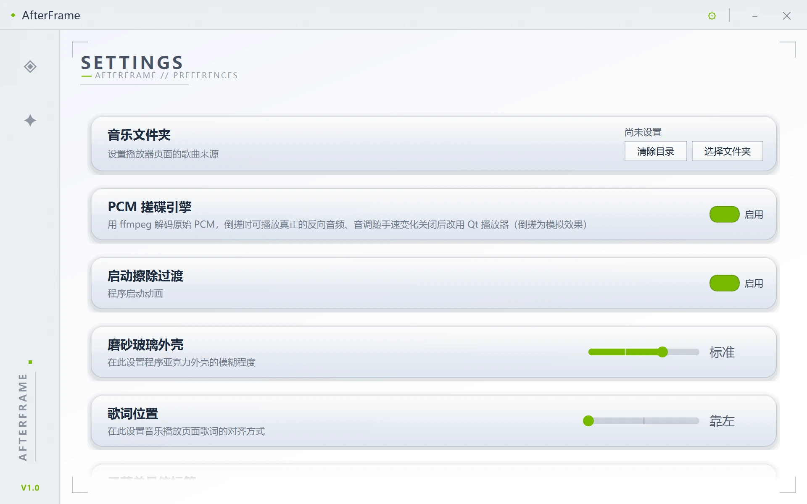
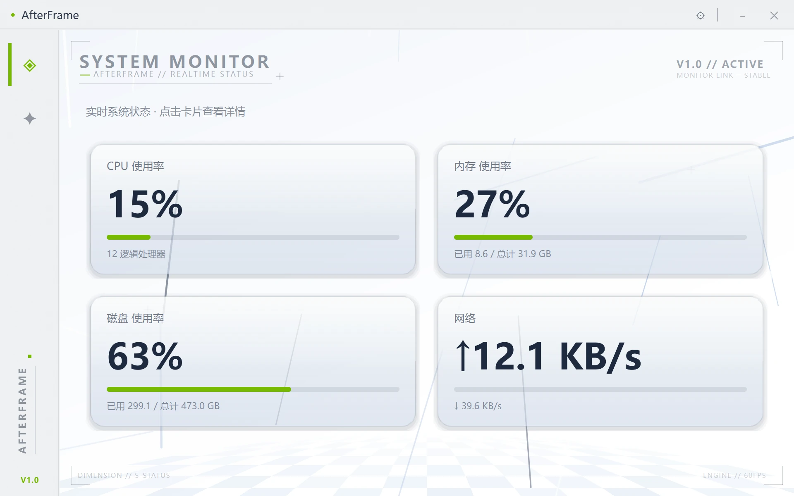

# AfterFrame

一个用 PySide6 写的无边框桌面音乐播放器。主界面是一只**可以真正用手搓的黑胶唱机**——按住唱片拖动，倒着搓就能听到真正的反向音频、音高随手上速度变化；配色跟着专辑封面走。另附一个系统监控页与设置页。

## 效果预览

**音乐播放页**



**设置页**



**系统监控页**



## 功能

### 音乐播放

- **真实的搓碟**：按住唱盘拖动即可搓碟。装了 ffmpeg 时走自研的 **PCM 转盘引擎**——倒搓播放真正的反向音频、音高随速度实时变化，松手后唱片按松手速度继续旋转并平滑回到正常转速；不装则回退到 Qt 播放器（倒搓为模拟效果）。
- **黑胶唱片交互**：唱片平时收在套里，可以拖出来或单击抽出；按住中心的纸标签向右拖即把它丢回套内（只认中心标签，按外圈一律是搓碟）。
- **封面驱动配色**：自动提取专辑封面调色板，格子、地面与节拍闪光各取一色。
- **歌词与曲目信息**：跟随播放进度，支持拖拽/滚轮手动浏览，停手 2 秒后自动回到当前播放位置；歌词位置（靠左 / 居中 / 靠右）可在设置页切换。**右键点某句歌词即可复制该句**（被复制的那句会闪一下作为提示）。
- **播放列表**：搜索框实时过滤（按歌名、忽略大小写），行控件按需创建；超长的歌名与专辑信息会自动横向滚动展示完整内容。
- **视觉化效果可切换**：可视化效果菜单可选择「棋盘格」或「音乐色彩」作为可视化效果，选择会被记住。

### 界面

- **无边框 + 磨砂玻璃外壳**：标题栏与侧边栏用 Windows 合成器材质做出亚克力效果，页面区保持不透明；磨砂程度可在设置页分四档调节（不透明 / 微透 / 标准 / 通透），系统未开启透明效果时安静地退回纯色外壳。
- **果冻式缩放手感**：拖动边缘 1:1 跟随，**松手瞬间**才施加弹性——被抓的边冲过目标、回落、带阻尼振荡稳定；继续往内拖会像橡皮筋一样按递减比例继续压缩，松手后弹开（目前效果不佳，两个手感都可在常量里关掉）。
- **侧边栏 / 标题栏跟随页面主题**：亮色页（监控、设置）用深色文字，暗色页（音乐）用浅色文字。
- **启动与关闭动画**：从鼠标位置弹性展开的小窗、绿色竖条划过、字母逐个跟随；启动时绿条扫过之处才显出真正的界面（可在设置页关闭）。关闭时绿色长条横扫窗口，像擦除一样让窗口消失。
- **系统监控页**：四张冷灰玻璃卡片（CPU / 内存 / 磁盘 / 网络），悬停抬升，点击展开详情面板；底部透视棋盘地面会随正在播放的音乐律动。
- **最大化为移除状态**：窗口可以拖动边缘自由缩放，但没有最大化按钮，双击标题栏也不会最大化。

## 运行

需要 Python 3.10+。

```powershell
python -m venv .venv
.venv\Scripts\activate
pip install -r requirements.txt
python run.py
```

## 依赖

- **PySide6** 6.6+、**psutil** 5.9+（`requirements.txt`）
- **ffmpeg**（可选但推荐）：启用真倒放搓碟的 PCM 引擎；其 `ffprobe` 也用于解析部分音频的内嵌封面与歌词。未安装时功能仍在，只是搓碟变成模拟效果、部分元数据读不到。

```powershell
ffprobe -version   # 确认它在 PATH 里
```

## 已知限制

- **仅 Windows**：磨砂玻璃外壳、窗口缩放抓取与任务栏动画都依赖 Win32 API，其它平台未做适配。
- **Windows 11 任务栏**：最小化动画只能对准任务栏中心，无法精确对准应用自己的图标。
- **`.ncm` 格式**：支持直接播放（加载时解成临时 flac，退出即清理）。这是外壳格式而非音频，如果容器内**不含歌词文本**，那么这类文件将不会显示歌词；解出的文件会临时占用与原文件相当的空间。
- **无 ffmpeg 时**：搓碟为模拟效果（无法真正倒放），部分音频的封面与内嵌歌词读不到。

## 开发

改代码前可以先阅读 [DEVELOPMENT.md](DEVELOPMENT.md)：验证流程、测量纪律，以及一批踩过的坑（Qt 绘制、推送式音频设备、离屏平台的陷阱等）。

## 许可证

[MIT](LICENSE)
